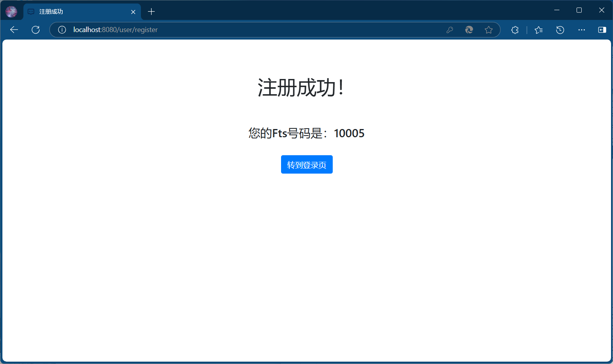
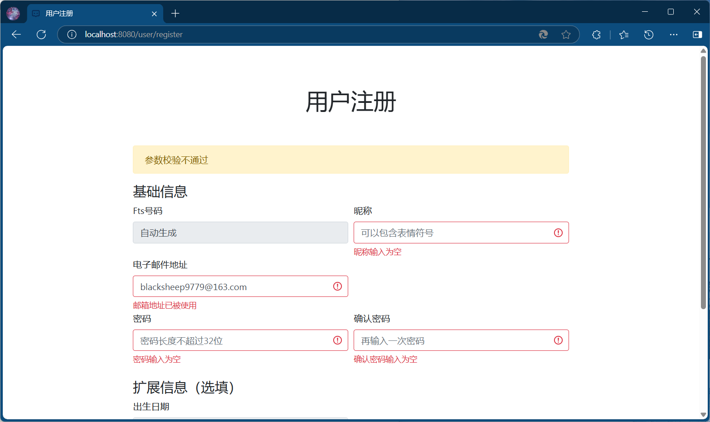
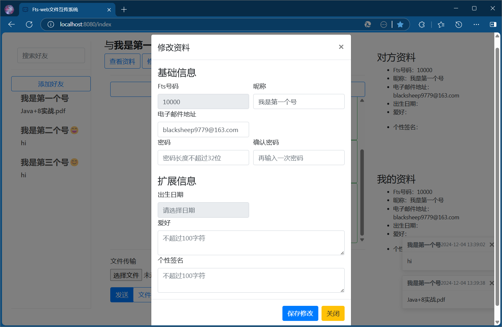
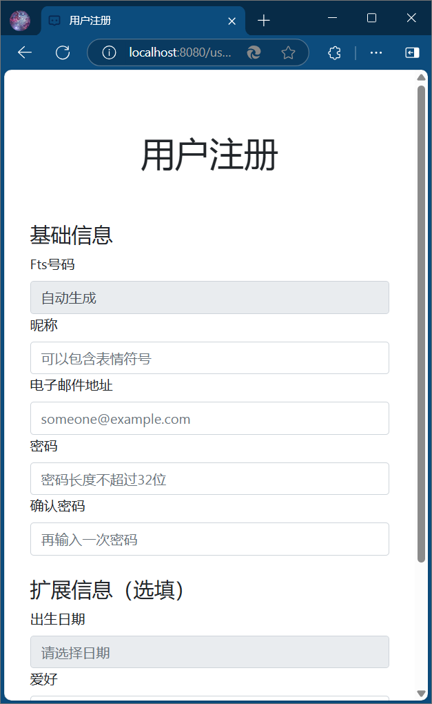

### 文件互传系统【fts-web】

-----------

一套适用于web的文件互传系统fts-web，提供用户登录、注册、收发消息、互传文件的功能。

主要功能：
- 支持多端登录（即同一账号在不同设备、同一设备多种浏览器登录），可以给自己发消息、发文件
- 提供用户登录注册功能，用户可以通过Fts号码或电子邮件登录，用户注册成功会返回Fts号码，注册失败会针对每个表单输入项给出提示。注册表单可以包含表情符号。

- 登录成功后主界面提供收发消息、收发文件、添加好友、清理信息功能。文件有7天有效期你，过期自动清理。大屏浏览器右边栏会展示对方和自己的资料。

- 支持用户资料的查看和修改。用户资料包括Fts号码、昵称、电子邮件、出生日期、爱好、个性签名，支持修改密码。不存储原始密码，存储加密后的密文。

- 接收到文本或文件消息，会在浏览器右下角处收到toast提示。
- 在小屏设备上页面会自适应表单输入项的大小。

项目使用Maven构建，使用java+Spring Boot+Thymeleaf+Bootstrap+JQuery开发，使用MySQL数据库+MyBatis。支持动态数据源，见[application-dev.properties](src/main/resources/application-dev.properties)。 建表语句在[create_tables.sql](src/main/resources/create_tables.sql)。

| 依赖项  | 依赖版本           |
|------|----------------|
| Java | 1.8            |
|Spring Boot| 2.6.13         |
|Thymeleaf| 3.0.15.RELEASE |
|Bootstrap| 4.6.2          |
|JQuery| 3.7.1          |
|MySQL| 5.7.44         |
|MyBatis| 3.5.9          |

Fts号码通过user_fts_id表自增值分配，bigint类型，从10000开始分配，使用unsigned类型支持18446744073709551616-10000个号码的使用（百亿亿级）。

文件存储有7天有效期，存储路径位于系统根路径下的fts-web目录，按照Fts号码分开。最大上传1GB文件。